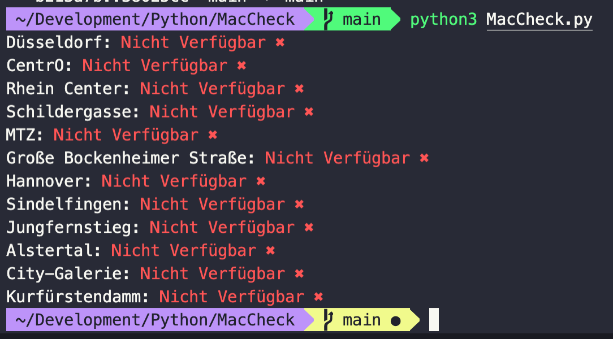

# MacCheck

> Python script to check MacBook Pro availability

## Table of Contents

- [General Info](#general-information)
- [Screenshots](#screenshots)
- [Room for Improvement](#room-for-improvement)
- [Contact](#contact)

## General Information

I ordered a standard config MacBook Pro and the delivery date was so late, that i created a script to check all Apple Stores in Germany if my MacBook was available for Pickup. I also implemented a Telegram Bot to message me if my config is available, so i can upload the script to AWS and create a lambda function to run every 15 min.

## Screenshots

## Room for Improvement

Could add User Input to not be limited to one country or MacBook configutation.

## Contact

Created by [@smueller264] - feel free to contact me!
